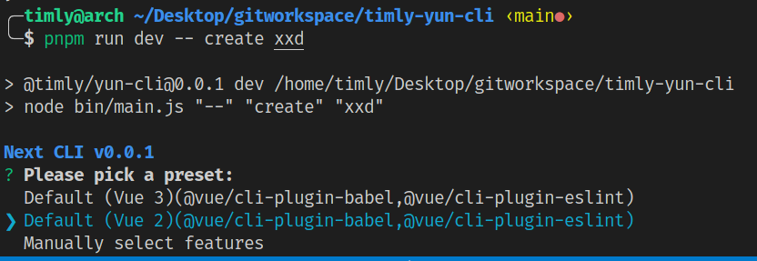
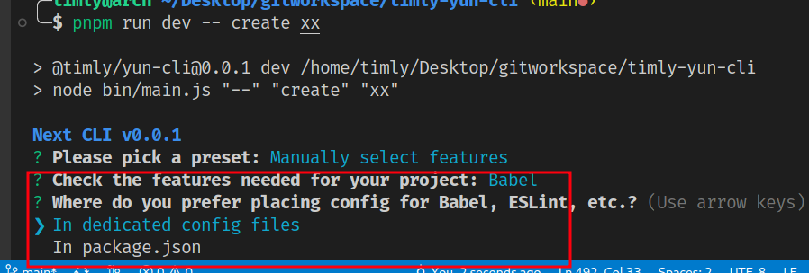
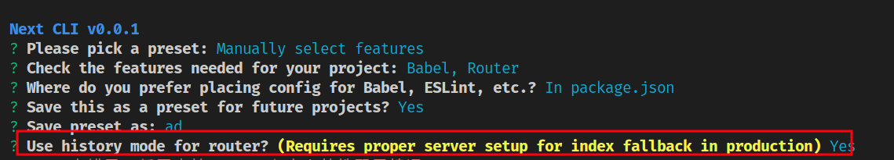

# 打造一款属于自己的脚手架（CLI）工具

> 脚手架是一种自动化工具，可以帮助我们快速搭建工程化项目。

## 一些交互工具

> 一个友好的脚手架工具，在开发过程中使用到一些辅助工具库，比如***交互提示，获取用户输入，高亮，生成模板***等等。

- commander
  - 一个命令行解决方案。通过它可以告诉用户脚手架的命令与功能，以及处理用户输入。

- chalk
  - 一个终端字符串美化工具。

- inquirer
  - 一个交互式命令行界面。提供了询问操作者问题，获取并解析用户输入，多层级的提示，提供错误回调，检测用户回答是否合法等能力。

- ejs
  - 一个高效的嵌入式 JavaScript 模板引擎。模板可以通过数据进行动态渲染。

## 项目搭建

### 初始化 package.json

1. 新建项目目录 timly-yun-cli 与 package.json 文件。

```sh
mkdir timly-yun-cli
cd timly-yun-cli
npm init
```

需要使用命令，则需要添加 bin 信息，bin 是配置命令名与脚本路径。命令名是 `@timly/yun-cli`，脚本路径是 bin/main.js，包名为 @timly/yun-cli。

```json
{
  "name": "@timly/yun-cli",
  "type": "commonjs",
+  "bin": {
+    "@timly/yun-cli": "bin/main.js"
+  },
}
```

### 脚本文件 `bin/main.js`

> 脚本文件 `bin/main.js`，用 `commander` 来向用户展示脚手架功能，用 `chalk` 来处理控制台高亮显示。该文件主要是处理交互与显示。脚手架的核心逻辑放到 `src/index.js`。

***脚本：bin/main.js***

```js
#!/usr/bin/env node

const { chalk, log } = require("@vue/cli-shared-utils"); // 这里使用 @vue/cli-shared-utils 中提供的 chalk 其实就是导出了 chalk库
const { Command } = require("commander");

const create = require("../src/index.js");

const program = new Command();

program
  .name("@timly/yun-cli")
  .description("一个神奇的项目自动化构建构建工具^_^")
  .usage("<command> [options]")
  .version("0.0.1");

program
  .command("create")
  .description("创建项目")
  .argument("<app-name>", "项目名称") // [xxx] xxx可选，<xxx> xxx必须
  .action((str, options) => {
    log(chalk.bold.blue(`Next CLI v0.0.1`));
    create(str, options);
  });

program.on("--help", () => {
  log(
    `\n  Run ${chalk.yellow(
      `@timly/yun-cli <command> --help`
    )} for detailed usage of given command.\n`
  );
});

program.parse(process.argv);
```

***src/index.js***

简单实现打印路径和项目名

```js
const path = require("path");

export async function create(projectName) {
  // 命令运行时的目录
  const cwd = process.cwd();
  // 目录拼接项目名
  const targetDir = resolve(cwd, projectName || ".");
  console.log(`创建项目的目录路径: ${targetDir}`);
}
```

## 建立链接

> 为了方便使用，都是通过***软链接***到全局执行环境然后使用，起到全局变量的作用。

用 npm link 命令可以将该 npm 包与命令软链接到全局执行环境，从而在任意位置可直接使用该命令。

```sh
npm link
```

PS：我这里就不使用这种方式了，直接运行脚本设置参数。

```sh
npm run dev -- create xxx
```

## 实现 Creator

> 需要使用到库 `inquirer`。`pnpm i -D inquirer`

### 脚本 bin/main.js

```js
const path = require("path");
const Creator = require("./create.js");

module.exports = async function (projectName, options) {
  // 命令运行时的目录
  const cwd = process.cwd();
  // 目录拼接项目名
  const targetDir = path.resolve(cwd, projectName || ".");
  // 实例化
  const creator = new Creator(projectName, targetDir);
  // 调用
  await creator.create();
};
```

### 初始化提示对话框

***src/create.js***

```js
class Creator {
  constructor (name, context) {
    // 项目名称
    this.name = name
    // 项目路径，含名称
    this.context = process.env.VUE_CLI_CONTEXT = context
    // 存放 package.json 数据
    this.pkg = {}
    // 包管理工具
    this.pm = null;
  }

  async create() {}
}

module.exports = Creator;
```

#### 预设一些用户提示操作选项

- 这里把提示选项分为 presetPrompt、featurePrompt、outroPrompts、injectedPrompts 四大类。
  - 首先是 presetPrompt，包含了 "Vue2 默认配置"，"Vue3 默认配置"，"自定义特性配置" 3 个选项。
  - 然后 featurePrompt 是 Babel、TypeScript、Vuex、PWA、Router、Vuex、CSS Pre-processors、Linter / Formatter、Unit Testing、E2E Testing 等等特性选项，他们是选择 "自定义特性配置" 时显示出来给用户选择。
  - 再然后 outroPrompts 是用于输出并保存配置选项。
  - 最后 injectedPrompts 是已有选项的补充，比如 vue版本选择，eslint 的详细配置，其他配置项。

接下来，依次在 constructor 中初始化 presetPrompt、featurePrompt、outroPrompts、injectedPrompts。

##### presetPrompt

> presetPrompt 是个单选框，有 Vue2 默认配置，Vue3 默认配置，自定义特性配置 3 个选项。单选框用 preset 记录用户选择的选项值。

***src/Creator.js***

```js
const inquirer = require('inquirer')
const { defaults } = require("./config/preset.js");

class Creator {
  constructor (name, context) {
    // 预设提示选项
    this.presetPrompt = this.resolvePresetPrompts()
  }

  // 获得预设的选项
  resolvePresetPrompts() {
    const presetChoices = Object.entries(defaults.presets).map(([name, preset]) => {
      return {
        name: `${name}(${Object.keys(preset.plugins).join(',')})`, // 将预设的插件放到提示
        value: name
      }
    })

    return {
      name: 'preset', // preset 记录用户选择的选项值。
      type: 'list', // list 表单选
      message: `Please pick a preset:`,
      choices: [
        ...presetChoices, // Vue2 默认配置，Vue3 默认配置
        {
          name: 'Manually select features', // 手动选择配置，自定义特性配置
          value: '__manual__'
        }
      ]
    }
  }
}
```

引入 `config/preset.js`， **预设了 babel 和 eslint**

```js
// 预设了 babel 和 eslint
const defaultPreset = {
  useConfigFiles: false,
  cssPreprocessor: undefined,
  plugins: {
    '@vue/cli-plugin-babel': {},
    '@vue/cli-plugin-eslint': {
      config: 'base',
      lintOn: ['save']
    }
  }
}

// vue2、vue3选项预设了 babel 和 eslint
const vuePresets = {
  'Default (Vue 3)': Object.assign({ vueVersion: '3' }, defaultPreset),
  'Default (Vue 2)': Object.assign({ vueVersion: '2' }, defaultPreset)
}

const defaults = {
  lastChecked: undefined,
  latestVersion: undefined,

  packageManager: undefined,
  useTaobaoRegistry: undefined,
  presets: vuePresets
}


module.exports = {
  defaultPreset,
  vuePresets,
  defaults
}
```

在 constructor 使用 调用 test 函数测试一下：

```js
class Creator {
  constructor (name, context) {

    // 测试（仅为测试代码，用完需删除）
    this.test();
  }

  test() {
    // 测试（仅为测试代码，用完需删除）
    inquirer.prompt(this.resolveFinalPrompts()).then(res => {
      console.log('选择的选项：')
      console.log(res)
    })
  }

  resolveFinalPrompts() {
    const prompts = [
      this.presetPrompt,
    ]
    return prompts
  }
}
```

运行 `node bin/main.js "--" "create" "xxd"`



##### featurePrompt

> presetPrompt 选择"Manually select features"时，需要进一步选择详细特性，如是否需要 Babel，是否需要 TypeScript 等等。
> featurePrompt 是个复选框，复选框的值有 Babel、TypeScript、Vuex、PWA、Router、Vuex、CSS Pre-processors、Linter / Formatter、Unit Testing、E2E Testing 等等特性选项。复选框用 features 记录用户选择的选项值。

***src/creator.js***

```js
class Creator {
  constructor (name, context) {
    // 自定义特性提示选项（复选框）
    this.featurePrompt = this.resolveFeaturePrompts()
  }

  // 自定义特性复选框
  resolveFeaturePrompts() {
    return {
      name: 'features', // features 记录用户选择的选项值。
      when: answers => answers.preset === '__manual__', // 当选择"Manually select features"时，该提示显示
      type: 'checkbox',
      message: 'Check the features needed for your project:',
      choices: [], // 复选框值，待补充
      pageSize: 10
    }
  }
}
```

接下来补充 featurePrompt.choices 的值。featurePrompt.choices 是自定义特性的选项，这里暂只考虑把 babel，router 放进来。

***src/PromptModuleAPI.js***
> PromptModuleAPI 类，实现了 injectFeature 方法，injectPrompt 方法，injectOptionForPrompt 方法，onPromptComplete 方法。他们被调用时依次往 Creator 的 featurePrompt.choices，injectedPrompts，promptCompleteCbs 变量填充数据。

```js
module.exports = class PromptModuleAPI {
  // 入参 creator 为 Creator 的实例。
  constructor (creator) {
    this.creator = creator
  }

  // 给 featurePrompt 注入复选框值
  injectFeature (feature) {
    this.creator.featurePrompt.choices.push(feature)
  }

  // 给 injectedPrompts 注入选项
  injectPrompt (prompt) {
    this.creator.injectedPrompts.push(prompt)
  }

  injectOptionForPrompt (name, option) {
    this.creator.injectedPrompts.find(f => {
      return f.name === name
    }).choices.push(option)
  }

  // 注入回调
  onPromptComplete (cb) {
    this.creator.promptCompleteCbs.push(cb)
  }
}
```

***src/promptModules/babel.js***

```js
module.exports = pmInstance => {
  pmInstance.injectFeature({
    name: 'Babel',
    value: 'babel',
    short: 'Babel',
    description: 'Transpile modern JavaScript to older versions (for compatibility)',
    link: 'https://babeljs.io/',
    checked: true
  })
}
```

***src/promptModules/router.js***

```js
module.exports = pmInstance => {
  pmInstance.injectFeature({
    name: 'Router',
    value: 'router',
    description: 'Structure the app with dynamic pages',
    link: 'https://router.vuejs.org/'
  })
}
```

除了 Babel，Router，实际中还需要有 TypeScript、Vuex、PWA、Vuex、CSS Pre-processors、Linter / Formatter、Unit Testing、E2E Testing 插件，因此根据需要可以再继续实现。

**constructor 中使用 PromptModuleAPI，getPromptModules。**

```js
const PromptModuleAPI = require('./PromptModuleAPI')
const { getPromptModules } = require('./config/prompt')

constructor() {
  // ...

  const promptAPI = new PromptModuleAPI(this)
  const promptModules = getPromptModules()
  promptModules.forEach(m => m(promptAPI))

  // 测试（仅为测试代码，用完需删除）...
}
```

***src/config/prompt.js***

```js
function getPromptModules() {
  return [
    'babel',
    'router',
  ].map(file => require(`../promptModules/${file}.js`))
}

module.exports = {
  getPromptModules
}
```

resolveFinalPrompts 方法添加 this.featurePrompt。

```js
// src/creator.js
class Creator {
  // ...
  resolveFinalPrompts() {
    const prompts = [
      this.presetPrompt,
      this.featurePrompt // +
    ]
    return prompts
  }
}
```

测试一下，选择"Manually select features"。并选择 Babel 和 Router。features 记录用户选择的选项值。


##### outroPrompts

> presetPrompt 选择"Manually select features"时，有一些保存操作需要让用户选择，如询问是否将本次自定义配置保存下来以便下次使用，询问 Babel/ESLint 的配置放在 package.json 还是新建文件保存等等。outroPrompts就是这类型的提示选项。

***src/creator.js***

```js
class Creator {
  constructor (name, context) {
    // 保存相关提示选项
    this.outroPrompts = this.resolveOutroPrompts()
  }

  // 保存相关提示选项
  resolveOutroPrompts() {
    const outroPrompts = [
      // useConfigFiles 是单选框提示选项。
      {
        name: 'useConfigFiles',
        when: answers => answers.preset === '__manual__',
        type: 'list',
        message: 'Where do you prefer placing config for Babel, ESLint, etc.?',
        choices: [
          {
            name: 'In dedicated config files',
            value: 'files'
          },
          {
            name: 'In package.json',
            value: 'pkg'
          }
        ]
      },
      // 确认提示选项
      {
        name: 'save',
        when: answers => answers.preset === '__manual__',
        type: 'confirm',
        message: 'Save this as a preset for future projects?',
        default: false
      },
      // 输入提示选项
      {
        name: 'saveName',
        when: answers => answers.save,
        type: 'input',
        message: 'Save preset as:'
      }
    ]
    return outroPrompts
  }
}
```

resolveFinalPrompts 方法添加 this.outroPrompts。

```js
// src/creator.js
class Creator {
  resolveFinalPrompts() {
    const prompts = [
      this.presetPrompt,
      this.featurePrompt,
      ...this.outroPrompts, // +
    ]
    return prompts
  }
}
```



##### injectedPrompts

```js
// src/creator.js
class Creator {
  constructor (name, context) {
    // 其他提示选项
    this.injectedPrompts = []
  }
}
```

injectedPrompts 是给已有选项的补充，比如 vue版本选择，eslint 的详细配置。跟 featurePrompt 一样，各个插件的补充选项按模块划分放到 promptModules 目录，然后再通过 PromptModuleAPI 注入到 injectedPrompts。有了前面的基础，这里只需补充 promptModules 目录里的文件即可。

router.js 添加选项： pmInstance 是 PromptModuleAPI 的实例，pmInstance.injectPrompt 给 injectedPrompts 注入 historyMode 选项。

***src/promptModules/router.js***

```js
const { chalk } = require('@vue/cli-shared-utils')

module.exports = pmInstance => {
  // 追加代码：
  pmInstance.injectPrompt({
    name: 'historyMode',
    when: answers => answers.features && answers.features.includes('router'),
    type: 'confirm',
    message: `Use history mode for router? ${chalk.yellow(`(Requires proper server setup for index fallback in production)`)}`,
    description: `By using the HTML5 History API, the URLs don't need the '#' character anymore.`,
    link: 'https://router.vuejs.org/guide/essentials/history-mode.html'
  })
}
```

resolveFinalPrompts 方法添加 this.injectedPrompts。

```js
// src/creator.js
class Creator {
  // ...
  resolveFinalPrompts() {
    const prompts = [
      this.presetPrompt,
      this.featurePrompt,
      ...this.outroPrompts,
      ...this.injectedPrompts // +
    ]
    return prompts
  }
}
```

测试一下， 选择"Manually select features"。多了一个 "Use history mode for router?" 选项。


##### promptCompleteCbs

自定义配置可能需要一些信息记录到其对应的插件上，比如 @vue/cli-plugin-router 记录 history 模式。promptCompleteCbs 则来做这件事。

```js
//src/creator.js
class Creator {
  constructor (name, context) {
    // 回调
    this.promptCompleteCbs = []
  }
}
```

src/promptModules/router.js pmInstance 是 PromptModuleAPI 的实例，pmInstance.onPromptComplete 将回调函数放到 promptCompleteCbs 数组中，等到执行数组里的回调时，option 记录 @vue/cli-plugin-router 插件的 historyMode 信息。

***src/promptModules/router.js***

```js
module.exports = pmInstance => {
 // 追加代码：
  pmInstance.onPromptComplete((answers, options) => {
    if (answers.features && answers.features.includes('router')) {
      options.plugins['@vue/cli-plugin-router'] = {
        historyMode: answers.historyMode
      }
    }
  })
}
```

最后 constructor 中代码如下：

```js
const inquirer = require('inquirer')
const PromptModuleAPI = require('./PromptModuleAPI.js')
const { getPromptModules } = require('./config/prompt.js')
const { defaults } = require('./config/preset.js')

class Creator {
  constructor (name, context) {
    // 项目名称
    this.name = name
    // 项目路径，含名称
    this.context = process.env.VUE_CLI_CONTEXT = context
    // package.json 数据
    this.pkg = {}
    // 包管理工具
    this.pm = null;
    // 预设提示选项
    this.presetPrompt = this.resolvePresetPrompts()
    // 自定义特性提示选项（复选框）
    this.featurePrompt = this.resolveFeaturePrompts()
    // 保存相关提示选项
    this.outroPrompts = this.resolveOutroPrompts()
    // 其他提示选项
    this.injectedPrompts = []
    // 回调
    this.promptCompleteCbs = []

    const promptAPI = new PromptModuleAPI(this)
    const promptModules = getPromptModules();
    promptModules.forEach(m => m(promptAPI))
  }
}
```

getPromptModules 方法获取了 src/promptModules 目录下每个模块，执行每个模块，参数为PromptModuleAPI 类的实例。src/promptModules 目录下每个模块的特性添加到了 featurePrompt 或 outroPrompts 或 injectedPrompts 或 promptCompleteCbs。

### 处理用户输入

***src/create.js***

```js
const { chalk } = require('@vue/cli-shared-utils')
const { vuePresets } = require('./config/preset.js')

async promptAndResolvePreset () {
  try {
    let preset;
    const { name } = this
    const answers = await inquirer.prompt(this.resolveFinalPrompts());

    // answers 得到的值为 { preset: 'Default (Vue 2)' }

    if (answers.preset && answers.preset === 'Default (Vue 2)') {
      if (answers.preset in vuePresets) {
        preset = vuePresets[answers.preset]
      }
    } else {
      // 暂不支持 Vue3、自定义特性配置情况
      throw new Error('哎呀，出错了，暂不支持 Vue3、自定义特性配置情况')
    }

    // 添加 projectName 属性
    preset.plugins['@vue/cli-service'] = Object.assign({
      projectName: name
    }, preset)

    return preset;
  } catch (err) {
    console.log(chalk.red(err));
    process.exit(1);
  }
}
```

create 方法引入 promptAndResolvePreset 方法

```js
// src/creator.js
async create() {
  const preset = await this.promptAndResolvePreset();

  // 测试（仅为测试代码，用完需删除）
  console.log('preset 值：')
  console.log(preset);
}
```

preset的值为：

```json
{
  vueVersion: '2',
  useConfigFiles: false,
  cssPreprocessor: undefined,
  plugins: <ref *1> {
    '@vue/cli-plugin-babel': {},
    '@vue/cli-plugin-eslint': { config: 'base', lintOn: [Array] },
    '@vue/cli-service': {
      projectName: 'demo',
      vueVersion: '2',
      useConfigFiles: false,
      cssPreprocessor: undefined,
      plugins: [Circular *1]
    }
  }
}
```

### 初始化安装环境，安装内置插件

需要 `fs-extra`

```sh
pnpm i fs-extra
```

initPackageManagerEnv 方法的实现。用于初始化安装环境，包管理器检验，初始化 package.json。

***src/create.js***

```js
const { log, hasGit, hasProjectGit, execa } = require('@vue/cli-shared-utils')
const PackageManager = require('./PackageManager')
const { writeFileTree } = require('./utils.js')

// preset 项目预设信息
async initPackageManagerEnv(preset) {
  const { name, context } = this

  // 实例化 PackageManager，用它来安装依赖
  this.pm = new PackageManager({ context })

  // 打印提示
  log(`✨ 创建项目：${chalk.yellow(context)}`)

  // 用于生成 package.json 文件的对象，将 preset 的插件及其版本号放到 pkg.devDependencies
  const pkg = {
    name,
    version: '0.1.0',
    private: true,
    devDependencies: {},
  }

  // 给 npm 包指定版本，简单做，使用最新的版本
  const deps = Object.keys(preset.plugins)
  deps.forEach(dep => {
    let { version } = preset.plugins[dep]
    if (!version) {
      version = 'latest'
    }
    pkg.devDependencies[dep] = version
  })

  this.pkg = pkg;

  // 写 package.json 文件
  await writeFileTree(context, {
    'package.json': JSON.stringify(pkg, null, 2)
  })

  // 初始化 git 仓库，以至于 vue-cli-service 可以设置 git hooks
  const shouldInitGit = this.shouldInitGit()
  if (shouldInitGit) {
    log(`🗃 初始化 Git 仓库...`)
    await this.run('git init') // 等价执行 execa('git', ['init'], { cwd })，即是在终端 输入 git init 执行
  }

  // 安装插件 plugins
  log(`⚙ 正在安装 CLI plugins. 请稍候...`)

  // 安装项目需要的依赖。该方法会调用子进程安装依赖，执行的命令为：npm install --loglevel error --legacy-peer-deps。（npm 版本小于7执行 npm install --loglevel error）
  await this.pm.install()
}

run (command, args) {
  if (!args) { [command, ...args] = command.split(/\s+/) }
  return execa(command, args, { cwd: this.context })
}

// 判断是否可以初始化 git 仓库：系统安装了 git 且目录下未初始化过，则初始化
shouldInitGit () {
  if (!hasGit()) {
    // 系统未安装 git
    return false
  }

  // 项目未初始化 Git
  return !hasProjectGit(this.context)
}
```

create 方法引入 promptAndResolvePreset 方法

```js
async create(cliOptions = {}) {
  const preset = await this.promptAndResolvePreset();
  await this.initPackageManagerEnv(preset); // +
}
```

### 生成项目文件，生成配置文件

> generate 方法用于生成项目文件，如 vue 文件，js 文件，css 文件，babel 配置文件，eslint 配置文件。

```js
// src/creator.js
const Generator = require('./Generator.js')

async generate(preset) {
  // 打印
  log(`🚀 准备相关文件...`)
  const { pkg, context } = this

  /*
  plugins: 获取插件信息。每个插件独立实现文件模板，完成生成相关文件的功能。
  generator: 实例化 Generator。Generator 生成文件的能力。
  generator.generate: 依据文件模板，生成文件。
  */
  const plugins = await this.resolvePlugins(preset.plugins, pkg)

  const generator = new Generator(context, {
    pkg,
    plugins
  })

  // 赋值模板 start
  await generator.generate({
    extractConfigFiles: preset.useConfigFiles // false
  })
  log(`🚀 相关文件已写入磁盘！`)

  await this.pm.install()

  return generator;
}
```

每个插件都有一个 generator 模块，独立实现文件模板，实现生成相关文件的功能。resolvePlugins 方法把 generator 模块引入过来，定义为 apply 方法，放到 preset.plugins 里。

```js
// src/creator.js
const { loadModule } = require('@vue/cli-shared-utils')
const { sortObject } = require('./util/util.js')

async resolvePlugins (rawPlugins) {
  // 插件排序，@vue/cli-service 排第1个
  rawPlugins = sortObject(rawPlugins, ['@vue/cli-service'], true)
  const plugins = []

  for (const id of Object.keys(rawPlugins)) {
    // require('@vue/cli-service/generator')
    // require('@vue/cli-plugin-babel/generator')
    // require('@vue/cli-plugin-eslint/generator')
    const apply = loadModule(`${id}/generator`, this.context) || (() => {})
    let options = rawPlugins[id] || {}
    plugins.push({ id, apply, options })
  }

  return plugins
}
```

3个默认内置的插件 @vue/cli-service，@vue/cli-plugin-babel，@vue/cli-plugin-eslint。@vue/cli-service用于生成项目文件和 vue.config.js，@vue/cli-plugin-babel 生成 babel 配置文件，@vue/cli-plugin-eslint 生成 eslint 配置文件

loadModule 方法返回一个类似于 require 方法的函数，用于导入插件的 generator 模块：@vue/cli-service/generator，@vue/cli-plugin-babel/generator，@vue/cli-plugin-eslint/generator。执行 apply 方法时，执行这些 generator 模块。

create 方法引入 promptAndResolvePreset 方法

```js
// src/creator.js
async create(cliOptions = {}) {
  const preset = await this.promptAndResolvePreset();
  await this.initPackageManagerEnv(preset);
  const generator = await this.generate(preset); // +
}
```

### 收尾与测试

> generateReadme 方法生成 readme 文件。
>
> finished 方法用于提示项目生成完成。

```js
// src/creator.js
const { generateReadme, writeFileTree } = require('./util/util.js')
const { chalk, log } = require('@vue/cli-shared-utils')

async generateReadme(generator) {
  log()
  log('📄 正在生成 README.md...')
  const { context } = this
  await writeFileTree(context, {
    'README.md': generateReadme(generator.pkg)
  })
}

finished() {
  const { name } = this
  log(`🎉 成功创建项目 ${chalk.yellow(name)}.`)
  log(`👉 用以下命令启动项目 :\n\n` + chalk.cyan(`cd ${name}\n`) + chalk.cyan(`npm run serve`))
}
```

create 方法引入 generateReadme 方法，finished 方法。

```js
// src/creator.js
async create(cliOptions = {}) {
  const preset = await this.promptAndResolvePreset();
  await this.initPackageManagerEnv(preset);
  const generator = await this.generate(preset);
  await this.generateReadme(generator); // +
  this.finished(); // +
}
```

## 实现 Generator

> Generator 统筹实现了项目文件，配置文件的生成。

### ConfigTransform.js 类用于获取配置文件名及内容

> ConfigTransform 类，用于获取配置文件名及内容，并转换内容为文本。配置文件名可能是 js 后缀的文件，json 后缀的文件，或yaml 后缀的文件，本文暂只考虑 js 后缀的配置文件。

```sh
pnpm i javascript-stringify
```

***src/ConfigTransform.js***

```js
/*constructor 接收参数：文件信息，如{ js: ['vue.config.js'] }、{ js: ['babel.config.js'] }

transform，getContent 函数用于组装配置文件的内容。transform 由外部调用传入文件内容。

getDefaultFile 函数用于获取默认文件类型及文件名。获取 fileDescriptor 第1个对象作为 type 和 filename作为文件类型及文件名。
*/const { stringifyJS } = require("./utils.js");

class ConfigTransform {
  // 文件信息
  constructor(options) {
    this.fileDescriptor = options;
  }

  // value 文件内容
  transform(value) {
    let file = this.getDefaultFile();
    const { type, filename } = file;

    if (type !== "js") {
      throw new Error("哎呀，出错了，仅支持 js 后缀的配置文件");
    }

    const content = this.getContent(value, filename);

    return {
      filename,
      content,
    };
  }

  getContent(value, filename) {
    if (filename === "vue.config.js") {
      return (
        `const { defineConfig } = require('@vue/cli-service')\n` +
        `module.exports = defineConfig(${stringifyJS(value, null, 2)})`
      );
    } else {
      return `module.exports = ${stringifyJS(value, null, 2)}`;
    }
  }

  // 获取 fileDescriptor 第1个对象作为 type 和 filename
  getDefaultFile() {
    const [type] = Object.keys(this.fileDescriptor);
    const [filename] = this.fileDescriptor[type];
    return { type, filename };
  }
}

module.exports = ConfigTransform;
```

### GeneratorAPI.js 类用于提取文件信息，配置信息

> 用于提取文件信息，配置信息。主要了解其2个方法，extendPackage 方法用于将信息记录到 pkg 变量，render 方法读取模板文件。

```sh
pnpm i globby@11.0.2 ejs isbinaryfile
```

***src/GeneratorAPI.js***

```js
const { getPluginLink, toShortPluginId } = require('@vue/cli-shared-utils')

class GeneratorAPI {
  /*
  id: 插件 ID，如 @vue/cli-service, @vue/cli-plugin-babel。
  generator: 是 Generator 实例。
  options: 插件 options，如 options: { projectName: 'aaa', vueVersion: '2'...}
   */
  constructor (id, generator, options, rootOptions) {
    this.id = id
    this.generator = generator
    this.options = options
    this.rootOptions = rootOptions

    /*
    pluginsData: [
      { name: 'babel',link: 'https://github.com/vuejs/vue-cli/tree/dev/packages/%40vue/cli-plugin-babel' },
      { name: 'eslint', link: 'https://github.com/vuejs/vue-cli/tree/dev/packages/%40vue/cli-plugin-eslint' }
    ]
    */
    this.pluginsData = generator.plugins
      .filter(({ id }) => id !== `@vue/cli-service`)
      .map(({ id }) => ({
        name: toShortPluginId(id),
        link: getPluginLink(id)
      }))


    this._entryFile = undefined
  }
}

module.exports = GeneratorAPI;
```

render 方法: 提取模板内容。

```js
// src/GeneratorAPI.js
const path = require('path')
const { getPluginLink, toShortPluginId } = require('@vue/cli-shared-utils')
const { extractCallDir } = require('./util/util')

render (source, additionalData = {}) {
  const baseDir = extractCallDir()

  if (typeof source === 'string') {
    // 获得模板路径
    source = path.resolve(baseDir, source)

    // 暂存
    this._injectFileMiddleware(async (files) => {

      const data = this._resolveData(additionalData)
      // 读取 source 目录下所有文件
      const globby = require('globby')
      const _files = await globby(['**/*'], { cwd: source, dot: true })

      for (const rawPath of _files) {
        // 生成文件时，_ 换成 .   __直接删掉
        const targetPath = rawPath.split('/').map(filename => {
          if (filename.charAt(0) === '_' && filename.charAt(1) !== '_') {
            return `.${filename.slice(1)}`
          }
          if (filename.charAt(0) === '_' && filename.charAt(1) === '_') {
            return `${filename.slice(1)}`
          }
          return filename
        }).join('/')

        // 源文件路径
        const sourcePath = path.resolve(source, rawPath)
        // 读取文件内容
        const content = this.renderFile(sourcePath, data)
        // files 记录文件及文件内容
        if (Buffer.isBuffer(content) || /[^\s]/.test(content)) {
          files[targetPath] = content
        }
      }
    })
  }
}

// 合并 option
_resolveData (additionalData) {
  return Object.assign({
    options: this.options,
    rootOptions: this.rootOptions,
    plugins: this.pluginsData
  }, additionalData)
}

_injectFileMiddleware (middleware) {
  /*
    middleware 是一个函数，_injectFileMiddleware 用于暂存将 middleware 函数到 generator.fileMiddlewares。执行时接收"文件集合"参数，将 @vue/cli-service/generator/template 下的目录及文件提取给 Generator 实例的 files变量。
  */
  this.generator.fileMiddlewares.push(middleware)
}
```

renderFile 方法：读取文件，然后用 ejs 渲染

```js
// src/GeneratorAPI.js

const fs = require('fs')
const ejs = require('ejs')
const path = require('path')
const { isBinaryFileSync } = require('isbinaryfile')

renderFile (name, data) {
  // 二进制文件，如图片，直接返回
  if (isBinaryFileSync(name)) {
    return fs.readFileSync(name)
  }

  // 其他文件用 ejs 渲染返回
  const template = fs.readFileSync(name, 'utf-8')
  return ejs.render(template, data)
}
```
